# Navigating Asymmetry: Insights from Aggregate and Choice Models on the Influence of Regular Prices and Discounts on Retailer Performances

### Author:
Tanetpong (Ned) Choungprayoon, [Rickard Sandberg](https://www.linkedin.com/in/rickard-sandberg-28531474/)

## Abstract:
The purpose of this study is to understand how retail promotional prices, which can be decomposed into regular prices and discounts, work differently across store formats. Particularly, this study investigates the asymmetric elasticities of gains and losses between regular prices and discounts and the potential price encoding mechanisms when customers shopped across hypermarket and supermarket. Using the scanner data from 2014 to 2016 which comes from a membership database of a grocery retailer in The Nordics, we employed the aggregate sales response model to estimate the relevant elasticities of store brand and their potential asymmetricities between gains and losses as well as individual choice model to explore the price encoding mechanisms. Our empirical results suggest that discounts are more effective especially for hypermarket format and there are asymmetric elasticities in discounts. This implies that customers react more significantly when discounts offered are increased.

## Overview
The purpose of this repository is to publish the empirical research project conducted as part of my doctoral dissertation and to make the analysis part (with R) accessible, potentially inspiring further study. [The slides related to this study](https://github.com/tanetpongc/discounthreshold/blob/1bb89dece2afd21c0049779557cf1bf1af96a64d/slide_deck/Slides_nonlinear.pdf) are also available in this repository. The empirical data is obtained from the retailer and stored via **AWS** and retrieve using (Postgre) **SQL**. This project is supported by Torsten Söderbergs Stiftelse.

`slide_deck` contains the most updated slides

`data` contains *df.csv* which is simulated data, similar to our data structure (i.e. scanner data), used for the walkthrough and *Simulate_Data.R* illustrating how data is simulated

`analysis` contains R code used for **operationalizing and transforming scanner data** for aggregate model development (*data_operationalization_aggregate.R*) and choice model development (*data_operationalization_choice.R*) and R code used for analysis in this study including 

1. R code for **Empirical Testing for Brand Sales Model Specification** (aggregate_model_estimation.R) 

2. R code for (linear and nonlinear) **Aggregate Sales-Response Models** (*aggregate_model_estimation.R*) and 

3. R code for **Utility Choice Model** (*choice_model_estimation.R*)

`gen` contains transformed aggregate data (*df_bybrand_aggregate.csv*) and transform customer choice data (*df_choice.csv*) and empirical testing results (*empiricaltest_result.csv*)

`img` contains equation and visualization used in the walkthrough


## Walkthrough with simulated data
### Required package
For this project, we mainly use `data.table` for data simulation, data aggregation, `ggplot2` for visualization, `car` for testing effectiveness between regular price and discounts (if two coefficients are statistically equivalent), `lm` for testing evidence of nonlinearity by likelihood ratio and `mlogit` for estimating utility choice model with random parameters. Honestly, most of the work involves data transformation and operationalization (i.e., transforming customer scanner data aggregate data and customer chocie data).

<details>
  <summary>Load required package</summary>

```R
library(data.table)
library(data.table)
library(car)
library(lmtest)
library(mlogit)
```
</details>

### The data
**Setting**: We simulated scanner data from 150 customers shopping across formats (hypermarket, supermarket and conveniece store) imposing positive relationship between discounts and quantity sold and negative relationship between regular price and quantity sold. For simplicity, we walkthrough showing example of one category (category *z*). In category *z*, there are 5 brands available including "Brand A", "Brand B", "Brand C", "Brand D" and "Brand E".
<details>
  <summary>Import data</summary>

```R
df <- fread("../data/df.csv")
#Assuming we are interested in category z
df <- df[category == "z",]
```
</details>

| Variable        | Description                                                  |
|---------------|------------------------------------------------------------|
| cust    | Customer id                                 |
| week_nr| Week number |
| spend | Total money spent                   |
| brand | Brand purchased              |
| format | Store format                     |
| category| Category z                             |
| regprice |Regular prices (list price) |
| discount| Discounts offered |
| quantity| Quantity purchased |
| holiday | = 1 if week_nr is holiday, otherwise  0|

### Data transformation
As we are interested in both aggregate aspect (brand sales) and choice-level aspect we need to (1) transform by aggregating and operationalizing relevant variables into brand-level (2) calculate relevant variables by individual (e.g. price mister A paid last time he bought is not the same with price mister B paid last time he bought).

#### Aggregate data transformation
<details>
  <summary>Calculate (market-weighted average) brand variables</summary>

```R
df[, finalspending := regprice - discount]
df[, regpriceperunit := regprice/quantity]
df[, finalpriceperunit := finalspending /quantity]
df[, discountperunit :=  discount/quantity]

# Calculate weekly sales by brand
weeklysalesbybrand <- df[, .(totalsales = sum(quantity), LL = .N), by = .(week_nr,holiday, brand, format)]
#LL can be calculated by uniqueN(product_id) to count distinct product id

# Merge df_complete with weeklysalesbybrand and calculate weights
df_weightcalc <- merge(df, weeklysalesbybrand, by = c("week_nr","holiday", "brand", "format"))
df_weightcalc[, wp := quantity/totalsales]

# Calculate weighted averages
df_weightcalc[, avgregpriceperunit := regpriceperunit * wp]
df_weightcalc[, avgfinalprice := finalpriceperunit * wp]
df_weightcalc[, avgdiscount := discountperunit * wp]

# Aggregate by week_nr, brand, and format
df_bybrand <- df_weightcalc[, .(totalvolume = sum(quantity), 
                                totalvalue = sum(finalspending), 
                                LL = mean(LL), 
                                avgregprice = sum(avgregpriceperunit), 
                                avgfinalprice = sum(avgfinalprice), 
                                avgdiscount = sum(avgdiscount)), by = .(week_nr,holiday, brand, format)]

rm(weeklysalesbybrand,df_weightcalc)


df_bybrand[, depth := avgdiscount/avgregprice]
df_bybrand[, nondepth := 1 - depth]
```
</details>

<details>
  <summary>Calculate (1) log-transformed (market-weighted average) competitor brand variables (2) log-transformed lag variable (3) Gaussian-copula correction term  (4) first difference of log-transformed variables for aggregate model estimation and (5) (Final price, Regular price, Discounts) Gain and loss with respect to what offered the week before</summary>

```R
# Filter the data for brand "D" and then group by week_nr
brand_focal_week_data <- df[brand == brand_we_interested, .(formatvisit = uniqueN(format)), by = .(week_nr)]
weeks_with_allvisits <- brand_focal_week_data[formatvisit >= 3, week_nr]
df_store <- df[week_nr %in% weeks_with_allvisits]
rm(brand_focal_week_data)

df_store[, brand_focal := ifelse(brand == brand_we_interested, "Focal", "Nonfocal")]

#Generate (market-weighted average) brand_focal variables
df_store[, finalspending := regprice - discount]
df_store[, regpriceperunit := regprice/quantity]
df_store[, finalpriceperunit := finalspending /quantity]
df_store[, avgdiscountperunit :=  discount/quantity]

# Calculate weekly sales by brand_focal
weeklysalesbybrand <- df_store[, .(totalsales = sum(quantity), LL = .N), by = .(week_nr,holiday, brand_focal, format)]
#LL can be calculated by uniqueN(product_id) to count distinct product id

# Merge df_complete with weeklysalesbybrand and calculate weights
df_weightcalc <- merge(df_store, weeklysalesbybrand, by = c("week_nr","holiday", "brand_focal", "format"))
df_weightcalc[, wp := quantity/totalsales]

# Calculate weighted averages
df_weightcalc[, avgregpriceperunit := regpriceperunit * wp]
df_weightcalc[, avgfinalprice := finalpriceperunit * wp]
df_weightcalc[, avgavgdiscount := avgdiscountperunit * wp]

# Aggregate by week_nr, brand, and format
df_bybrand_focal <- df_weightcalc[, .(totalvolume = sum(quantity), 
                                totalvalue = sum(finalspending), 
                                LL = mean(LL), 
                                regprice = sum(avgregpriceperunit), 
                                finalprice = sum(avgfinalprice), 
                                discount = sum(avgavgdiscount)), by = .(week_nr,holiday, brand_focal, format)]

rm(weeklysalesbybrand,df_weightcalc)
#FOR SIMPLICITY WE SPLIT BETWEEN FOCAL BRAND AND NON-FOCAL BRAND, in the end we want detail of focal brand and non focal in the same row
weeklysalesbybrand_Focal <- df_bybrand_focal[df_bybrand_focal$brand_focal == "Focal",]
weeklysalesbybrand_Nonfocal <- df_bybrand_focal[df_bybrand_focal$brand_focal!= "Focal",]

# Rename columns to distinguish between Focal and Nonfocal
setnames(weeklysalesbybrand_Nonfocal, old = c("finalprice", "regprice", "discount"), 
         new = c("finalprice_Nonfocal", "regprice_Nonfocal", "discount_Nonfocal"))
setnames(weeklysalesbybrand_Focal, old = c("finalprice", "regprice", "discount"), 
         new = c("finalprice_Focal", "regprice_Focal", "discount_Focal"))

# Merge Focal and Nonfocal data
df_storeinfo <- merge(weeklysalesbybrand_Focal, weeklysalesbybrand_Nonfocal, by = c("week_nr", "format"))
df_storeinfo <- df_storeinfo[,c("week_nr","finalprice_Nonfocal","regprice_Nonfocal","discount_Nonfocal","finalprice_Focal","regprice_Focal","discount_Focal","format")]

# Create a function to streamline the creation of format-specific columns
create_format_specific_cols <- function(data, format_name) {
  cols <- c("finalprice", "regprice","discount")
  setnames(data, old = paste0(cols, "_Focal"), new = paste0(format_name, cols, "_Focal"))
  setnames(data, old = paste0(cols, "_Nonfocal"), new = paste0(format_name, cols, "_Nonfocal"))
  # Remove 'format' column
  data <- data[, !("format"), with = FALSE]
  return(data)
}

# Apply the function to each format and combine the results
storedf_hyper <- create_format_specific_cols(df_storeinfo[format == "hypermarket"], "hyper")
storedf_super <- create_format_specific_cols(df_storeinfo[format == "supermarket"], "super")
storedf_conve <- create_format_specific_cols(df_storeinfo[format == "convenience"], "conve")

# Combine all format data
# Assuming store_df, storedf_hyper, storedf_super, storedf_conve are your data frames
list_of_df_formats <- list(df_storeinfo, storedf_hyper, storedf_super, storedf_conve)

# Merge all data frames in the list based on 'vecka'
relevant_storedf <- Reduce(function(x, y) merge(x, y, by = c("week_nr"), all = TRUE), list_of_df_formats)
#we can check the avgregprice should be the same with format_avgregprice


# Find columns that match the patterns 'regprice_' or 'avgdiscount_'
finalprice_cols <- grep("finalprice_", names(relevant_storedf), value = TRUE)
regprice_cols <- grep("regprice_", names(relevant_storedf), value = TRUE)
discount_cols <- grep("discount_", names(relevant_storedf), value = TRUE)

# Combine these with the other column names
relevant_columns <- c("week_nr","format",finalprice_cols, regprice_cols,discount_cols)

# Subset the data.table with the relevant columns
relevant_storedf <- relevant_storedf[, ..relevant_columns]


# Optionally, remove unnecessary variables from environment
rm(list = c("df_bybrand_focal","weeklysalesbybrand_Nonfocal", "weeklysalesbybrand_Focal", "df_storeinfo", 
            "storedf_hyper", "storedf_super", "storedf_conve","list_of_df_formats"))

```
</details>

#### Customer choice data transformation
Calculating customer choice data is tricky, as we have scanner data, hence we will **infer** weekly brand attribute for each store format from the data. For simplicity, we only study **brand "D"**, hence we consider brand D as our focal brand making other 4 brands become competitive brand (or non-focal brand).

For customer choice data, customer-data price gain is different from aggregate-brand price gain. Customer price gain is when mister A pay less that what he paid prior time, regardless of store format he visited, while aggregate-brand price gain is when the brand offers less price at a particular format compared to the week before.

*Please note that there are a few assumption need to be made regarding how customers remember price and brand (e.g., customers only remember price last time they visit or last 2, 3,.. times)*

<details>
  <summary>Calculate weekly brand attribute at store-format level data</summary>

```R
# Filter the data for brand "D" and then group by week_nr
brand_focal_week_data <- df[brand == brand_we_interested, .(formatvisit = uniqueN(format)), by = .(week_nr)]
weeks_with_allvisits <- brand_focal_week_data[formatvisit >= 3, week_nr]
df_store <- df[week_nr %in% weeks_with_allvisits]
rm(brand_focal_week_data)

df_store[, brand_focal := ifelse(brand == brand_we_interested, "Focal", "Nonfocal")]

#Generate (market-weighted average) brand_focal variables
df_store[, finalspending := regprice - discount]
df_store[, regpriceperunit := regprice/quantity]
df_store[, finalpriceperunit := finalspending /quantity]
df_store[, avgdiscountperunit :=  discount/quantity]

# Calculate weekly sales by brand_focal
weeklysalesbybrand <- df_store[, .(totalsales = sum(quantity), LL = .N), by = .(week_nr,holiday, brand_focal, format)]
#LL can be calculated by uniqueN(product_id) to count distinct product id

# Merge df_complete with weeklysalesbybrand and calculate weights
df_weightcalc <- merge(df_store, weeklysalesbybrand, by = c("week_nr","holiday", "brand_focal", "format"))
df_weightcalc[, wp := quantity/totalsales]

# Calculate weighted averages
df_weightcalc[, avgregpriceperunit := regpriceperunit * wp]
df_weightcalc[, avgfinalprice := finalpriceperunit * wp]
df_weightcalc[, avgavgdiscount := avgdiscountperunit * wp]

# Aggregate by week_nr, brand, and format
df_bybrand_focal <- df_weightcalc[, .(totalvolume = sum(quantity), 
                                totalvalue = sum(finalspending), 
                                LL = mean(LL), 
                                regprice = sum(avgregpriceperunit), 
                                finalprice = sum(avgfinalprice), 
                                discount = sum(avgavgdiscount)), by = .(week_nr,holiday, brand_focal, format)]

rm(weeklysalesbybrand,df_weightcalc)
#FOR SIMPLICITY WE SPLIT BETWEEN FOCAL BRAND AND NON-FOCAL BRAND, in the end we want detail of focal brand and non focal in the same row
weeklysalesbybrand_Focal <- df_bybrand_focal[df_bybrand_focal$brand_focal == "Focal",]
weeklysalesbybrand_Nonfocal <- df_bybrand_focal[df_bybrand_focal$brand_focal!= "Focal",]

# Rename columns to distinguish between Focal and Nonfocal
setnames(weeklysalesbybrand_Nonfocal, old = c("finalprice", "regprice", "discount"), 
         new = c("finalprice_Nonfocal", "regprice_Nonfocal", "discount_Nonfocal"))
setnames(weeklysalesbybrand_Focal, old = c("finalprice", "regprice", "discount"), 
         new = c("finalprice_Focal", "regprice_Focal", "discount_Focal"))

# Merge Focal and Nonfocal data
df_storeinfo <- merge(weeklysalesbybrand_Focal, weeklysalesbybrand_Nonfocal, by = c("week_nr", "format"))
df_storeinfo <- df_storeinfo[,c("week_nr","finalprice_Nonfocal","regprice_Nonfocal","discount_Nonfocal","finalprice_Focal","regprice_Focal","discount_Focal","format")]

# Create a function to streamline the creation of format-specific columns
create_format_specific_cols <- function(data, format_name) {
  cols <- c("finalprice", "regprice","discount")
  setnames(data, old = paste0(cols, "_Focal"), new = paste0(format_name, cols, "_Focal"))
  setnames(data, old = paste0(cols, "_Nonfocal"), new = paste0(format_name, cols, "_Nonfocal"))
  # Remove 'format' column
  data <- data[, !("format"), with = FALSE]
  return(data)
}

# Apply the function to each format and combine the results
storedf_hyper <- create_format_specific_cols(df_storeinfo[format == "hypermarket"], "hyper")
storedf_super <- create_format_specific_cols(df_storeinfo[format == "supermarket"], "super")
storedf_conve <- create_format_specific_cols(df_storeinfo[format == "convenience"], "conve")

# Combine all format data
# Assuming store_df, storedf_hyper, storedf_super, storedf_conve are your data frames
list_of_df_formats <- list(df_storeinfo, storedf_hyper, storedf_super, storedf_conve)

# Merge all data frames in the list based on 'vecka'
relevant_storedf <- Reduce(function(x, y) merge(x, y, by = c("week_nr"), all = TRUE), list_of_df_formats)
#we can check the avgregprice should be the same with format_avgregprice


# Find columns that match the patterns 'regprice_' or 'avgdiscount_'
finalprice_cols <- grep("finalprice_", names(relevant_storedf), value = TRUE)
regprice_cols <- grep("regprice_", names(relevant_storedf), value = TRUE)
discount_cols <- grep("discount_", names(relevant_storedf), value = TRUE)

# Combine these with the other column names
relevant_columns <- c("week_nr","format",finalprice_cols, regprice_cols,discount_cols)

# Subset the data.table with the relevant columns
relevant_storedf <- relevant_storedf[, ..relevant_columns]


# Optionally, remove unnecessary variables from environment
rm(list = c("df_bybrand_focal","weeklysalesbybrand_Nonfocal", "weeklysalesbybrand_Focal", "df_storeinfo", 
            "storedf_hyper", "storedf_super", "storedf_conve","list_of_df_formats"))

```
</details>

<details>
  <summary>Calculate customer level data</summary>

```R
df_hh <- df_store #We selected the dataset that we have complete store formats information
df_choice <- merge(df_hh,relevant_storedf, by=c("week_nr","format")) #we need to maintain the format so we can conlude the price that customer encounter at the format the bought
remove(list=c("df_hh", "df_store","relevant_storedf","df"))


genattribute_focalbrand <- function(df,brand_we_interested,lambda_IRP,lambda_loyalty) {
  
  # Remove duplicates
  df <- unique(df, by = c("week_nr", "cust"))
  
  # Define choices
  df[, choice_Focal := ifelse(brand == brand_we_interested, 1, 0)]
  df[, choice_Nonfocal := ifelse(brand != brand_we_interested, 1, 0)]
  
  # Define lag function
  lag_1 <- function(x) shift(x, 1, type = "lag")
  
  # Order the dataframe for lagged operations
  df <- df[order(cust, week_nr)]
  
  # Function to calculate IRP
  calc_irp <- function(col, lambda_IRP) {
    col1 <- lag_1(col)
    col2 <- lag_1(col1)
    irp1 <- lambda_IRP * col2 + (1 - lambda_IRP) * col1
    irp <- lambda_IRP * irp1 + (1 - lambda_IRP) * col1
    return(list(irp1 = irp1, irp = irp))
  }
  
  # Calculate IRP for price and avgdiscount for both Focal and Nonfocal
  df[, c("IR_finalprice1_Focal", "IR_finalprice_Focal") := calc_irp(regprice_Focal, lambda_IRP)]
  df[, c("IR_regprice1_Focal", "IR_regprice_Focal") := calc_irp(regprice_Focal, lambda_IRP)]
  df[, c("IR_discount1_Focal", "IR_discount_Focal") := calc_irp(discount_Focal, lambda_IRP)]
  df[, c("IR_finalprice1_Nonfocal", "IR_finalprice_Nonfocal") := calc_irp(regprice_Nonfocal, lambda_IRP)]
  df[, c("IR_regprice1_Nonfocal", "IR_regprice_Nonfocal") := calc_irp(regprice_Nonfocal, lambda_IRP)]
  df[, c("IR_discount1_Nonfocal", "IR_discount_Nonfocal") := calc_irp(discount_Nonfocal, lambda_IRP)]
  
  # Calculate gain/loss variables
  gain_loss <- function(gap, format = NULL) {
    if (!is.null(format)) {
      gap <- gap * (df$format == format)
    }
    gain <- pmax(gap, 0)
    loss <- pmax(-gap, 0)
    return(list(gain = gain, loss = loss))
  }
  
  df[, c("finalpricegap_Focal","regpricegap_Focal", "discountgap_Focal","finalpricegap_Nonfocal" ,"regpricegap_Nonfocal", "discountgap_Nonfocal") := 
       .((finalprice_Focal - IR_finalprice_Focal),
         (regprice_Focal - IR_regprice_Focal), 
         (discount_Focal - IR_discount_Focal),
         (finalprice_Nonfocal - IR_finalprice_Nonfocal),
         (regprice_Nonfocal - IR_regprice_Nonfocal), 
         (discount_Nonfocal - IR_discount_Nonfocal))]
  
  # Apply gain/loss function to each format and type
  formats <- c("hyper", "super", "conve")
  for (focal in c("Focal", "Nonfocal")) {
    for (format in formats) {
      df[, c(paste0(format, "finalpricegain_", focal), paste0(format, "finalpriceloss_", focal)) := 
           gain_loss(get(paste0("regpricegap_", focal)), format)]
      df[, c(paste0(format, "regpricegain_", focal), paste0(format, "regpriceloss_", focal)) := 
           gain_loss(get(paste0("regpricegap_", focal)), format)]
      df[, c(paste0(format, "discountgain_", focal), paste0(format, "discountloss_", focal)) := 
           gain_loss(get(paste0("discountgap_", focal)), format)]
    }
  }
  
  # Calculate loyalty variable
  lambda_loyalty = lambda_loyalty
  
  # Calculate lagged loyalty variables
  df[, loyal1_Focal := lag_1(choice_Focal)]
  df[, loyal1_Nonfocal := lag_1(choice_Nonfocal)]
  
  # Calculate loyalty variables
  df[, loyal_Focal := lambda_loyalty * loyal1_Focal + (1 - lambda_loyalty) * choice_Focal]
  df[, loyal_Nonfocal := lambda_loyalty * loyal1_Nonfocal + (1 - lambda_loyalty) * choice_Nonfocal]
  df[, loyal := fifelse(choice_Nonfocal == 0, loyal_Nonfocal, loyal_Focal)]
  
  # Calculate format share
  df[, `:=` (supermarket_shop = as.integer(format == "supermarket"),
             hypermarket_shop = as.integer(format == "hypermarket"),
             convenience_shop = as.integer(format == "convenience"),
             shoppingtime = 1)]
  df[, `:=` (TotalShoppingtime = cumsum(shift(shoppingtime, fill = 1)),
             supermarkettime = cumsum(shift(supermarket_shop, fill = 0)),
             hypermarkettime = cumsum(shift(hypermarket_shop, fill = 0)),
             conveniencetime = cumsum(shift(convenience_shop, fill = 0))
  ), by = cust]
  
  df[, `:=` (sup_share = supermarkettime / TotalShoppingtime,
             hyper_share = hypermarkettime / TotalShoppingtime,
             conve_share = conveniencetime / TotalShoppingtime)]
  
  # Remove first week used for constructing IRP and Loyalty and duplicates
  df <- na.omit(df)
  df <- unique(df, by = c("week_nr", "cust"))
  
  return(df)
}

df_choicemade <- genattribute_focalbrand(df_choice,brand_we_interested = "D",lambda_IRP = 0.90,lambda_loyalty= 0.89)

```
</details>

<details>
  <summary>Widen data (for seperate choice) with attributes fitting with mlogit package </summary>

```R
choice_rearrange <- function(df_choicemade){
  
  df_choice_rearranged <-df_choicemade[,c("week_nr","cust","brand_focal",
                                          "hyperfinalprice_Focal","hyperfinalprice_Nonfocal","hyperregprice_Focal","hyperregprice_Nonfocal","hyperdiscount_Focal","hyperdiscount_Nonfocal",
                                          "superfinalprice_Focal","superfinalprice_Nonfocal","superregprice_Focal","superregprice_Nonfocal","superdiscount_Focal","superdiscount_Nonfocal",
                                          "convefinalprice_Focal","convefinalprice_Nonfocal","converegprice_Focal","converegprice_Nonfocal","convediscount_Focal","convediscount_Nonfocal",
                                          "hyperfinalpricegain_Focal","hyperfinalpricegain_Nonfocal","hyperfinalpriceloss_Focal","hyperfinalpriceloss_Nonfocal",
                                          "hyperregpricegain_Focal","hyperregpricegain_Nonfocal","hyperregpriceloss_Focal","hyperregpriceloss_Nonfocal",
                                          "hyperdiscountgain_Focal","hyperdiscountgain_Nonfocal","hyperdiscountloss_Focal","hyperdiscountloss_Nonfocal",
                                          "superfinalpricegain_Focal","superfinalpricegain_Nonfocal","superfinalpriceloss_Focal","superfinalpriceloss_Nonfocal",
                                          "superregpricegain_Focal","superregpricegain_Nonfocal","superregpriceloss_Focal","superregpriceloss_Nonfocal",
                                          "superdiscountgain_Focal","superdiscountgain_Nonfocal","superdiscountloss_Focal","superdiscountloss_Nonfocal",
                                          "convefinalpricegain_Focal","convefinalpricegain_Nonfocal","convefinalpriceloss_Focal","convefinalpriceloss_Nonfocal",
                                          "converegpricegain_Focal","converegpricegain_Nonfocal","converegpriceloss_Focal","converegpriceloss_Nonfocal",
                                          "convediscountgain_Focal","convediscountgain_Nonfocal","convediscountloss_Focal","convediscountloss_Nonfocal")]
  
  df_choice_tranformed <- dfidx(df_choice_rearranged, choice = "brand_focal", varying = 4:57, sep = "_")
  df_choice_tranformed$choice <- as.numeric(df_choice_tranformed$brand_focal)
  
  
  df_choicevariant_0 <- data.frame(df_choice_tranformed[,c("week_nr","cust","choice",                                                                              
                                                           "hyperfinalprice","hyperregprice","hyperdiscount","hyperfinalpricegain","hyperfinalpriceloss","hyperregpricegain","hyperregpriceloss","hyperdiscountgain","hyperdiscountloss",
                                                           "superfinalprice","superregprice","superdiscount","superfinalpricegain","superfinalpriceloss","superregpricegain","superregpriceloss","superdiscountgain","superdiscountloss",
                                                           "convefinalprice","converegprice","convediscount","convefinalpricegain","convefinalpriceloss","converegpricegain","converegpriceloss","convediscountgain","convediscountloss")])
  extract_index <- data.frame(df_choicevariant_0[,31])
  setnames(extract_index, new = c("chid","brand_alt"))
  df_choicevariant<- cbind(df_choicevariant_0,extract_index)
  
  
  df_choiceinvariant <- data.frame(df_choicemade[,c("week_nr","cust","brand_focal",
                                                    "loyal_Focal","loyal_Nonfocal","sup_share","hyper_share","conve_share")])
  
  df <- merge(df_choicevariant,df_choiceinvariant, by=c("week_nr","cust"))
  

    df$Nonfocal_intercept = ifelse(df$brand_alt == "Nonfocal", 1, 0)
    df$Focal_intercept = ifelse(df$brand_alt == "Focal", 1, 0)
    df$loyal_nonfocal = ifelse(df$brand_alt == "Nonfocal", df$loyal_Nonfocal, df$loyal_Focal)

  return(df)
}

df_choice <- choice_rearrange(df_choicemade)


#generate output
write.csv(df_choice,'../gen/df_choice.csv', row.names = TRUE)
```
</details>

### Model-free Evidence
<details>
  <summary>Plot relationship between brand B quantity sold and final price, regular prices and discounts</summary>

```R
ggplot(df_bybrand_formats[brand == "B",], aes(x = dlognondepth, y = dlogtotalvolume, color = format)) +
  geom_point() +
  geom_smooth(method = "lm", se = FALSE) +
  theme_minimal() +
  labs(title ="Effect of discounts change on sales of brand B", x = "(%) Change of (non) discount depth", y = "(%) Change of volume sold", color = "Format")

ggplot(df_bybrand_formats[brand == "B",], aes(x = dlogavgfinalprice, y = dlogtotalvolume, color = format)) +
  geom_point() +
  geom_smooth(method = "lm", se = FALSE) +
  theme_minimal() +
  labs(title ="Effect of final prices change on sales of brand B", x = "(%) Change of final price", y = " (%) Change of volume sold", color = "Format")

ggplot(df_bybrand_formats[brand == "B",], aes(x = dlogavgregprice, y = dlogtotalvolume, color = format)) +
  geom_point() +
  geom_smooth(method = "lm", se = FALSE) +
  theme_minimal() +
  labs(title ="Effect of regular prices change on sales of brand B", x = "(%) Change of regular price", y = " (%) Change of volume sold", color = "Format")


```
</details>

<figure>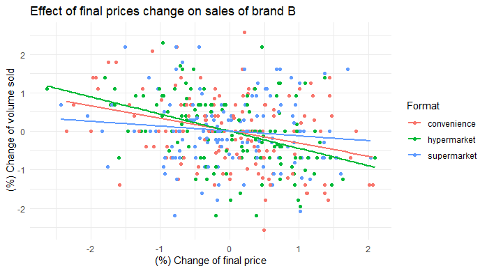<figcaption></figcaption></figure>
<figure>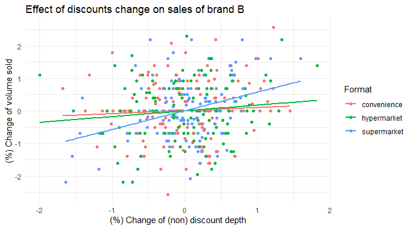<figcaption></figcaption></figure>
<figure>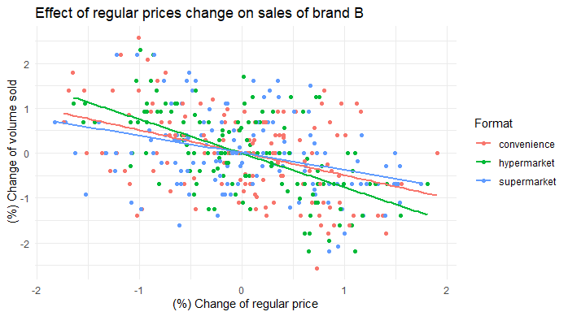<figcaption></figcaption></figure>

* Varying effect of final price, regular price and discounts across formats
* Mathematical decomposition of final price into regular price (list price) and discounts is shown in the appendix of [the slides](https://github.com/tanetpongc/discounthreshold/blob/1bb89dece2afd21c0049779557cf1bf1af96a64d/slide_deck/Slides_nonlinear.pdf)

<details>
  <summary>Plot brand attribute over time</summary>

```R
#Plot store offering
ggplot(relevant_storedf, aes(x = week_nr, y = regprice_Focal, color = format)) +
  geom_point() +
  geom_line() +
  theme_minimal() +
  labs(title ="Regular Prices offered of brand E over time", x = "Week (th)", y = "Regular Price", color = "Format")

ggplot(relevant_storedf, aes(x = week_nr, y = discount_Focal, color = format)) +
  geom_point() +
  geom_line() +
  theme_minimal() +
  labs(title ="Discounts offered of brand E over time", x = "Week (th)", y = "Regular Price", color = "Format")

```
</details>

<figure>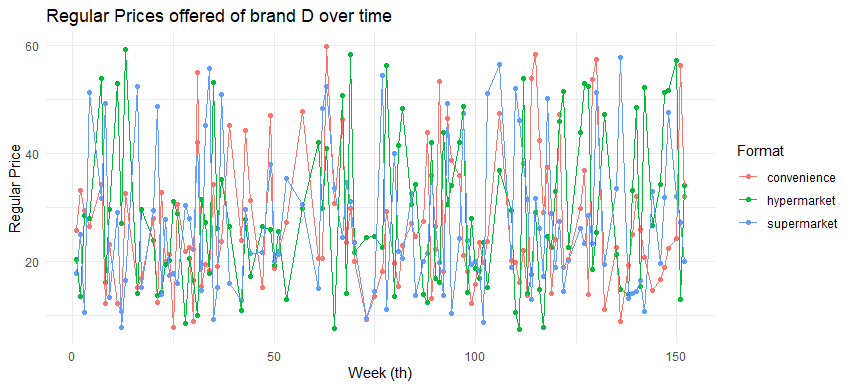<figcaption></figcaption></figure>
<figure>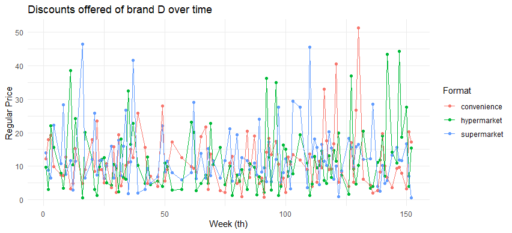<figcaption></figcaption></figure>

* Varying  regular price and discounts offered across formats, hence, customers who visit different store format at the different time would have different price information

<details>
  <summary>Compare (selected) customers price gap</summary>

```R
df_choicemade[, cust := as.factor(cust)]
ggplot(df_choicemade[df_choicemade$cust %in% c("15","43"),], 
       aes(x = week_nr, y = regpricegap_Focal, color = format, shape = cust)) +
  geom_point() +
  geom_line() +
  geom_hline(yintercept = 0, linetype = "dashed", color = "blue", size = 1) + # Add this line for the horizontal line
  theme_minimal() +
  labs(title = "Regular Price Gap of brand E when Customer 15th and 43th shopped over time", 
       x = "Week (th)", 
       y = "Regular Price Gap", 
       color = "Format", 
       shape = "Customer_id")

```
</details>

<figure>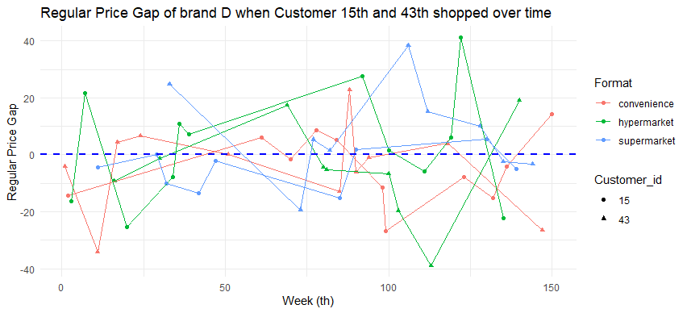<figcaption></figcaption></figure>

* Most of the time, customer 15 encountered cheaper prices of brand D (price gap is negative meaning that what he pays at the time is less than what he paid prior) compared to customer 43

### Empirical Testing for Brand Sales Model Specification
<figure>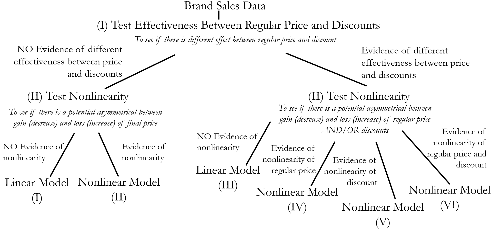<figcaption></figcaption></figure>

We are proposed research question and how to test as follows:
 - How does the decomposition of promotional prices into regular prices and discounts affect sales’ curves and the price elasticities?

    - Test effectiveness between regular price and discounts to see if there is different effect between these two variables
- Are there asymmetric elasticities of gains and losses between regular prices and discounts?
    - Test for nonlinearity to see if there is a potential asymmetrical between gain and loss of final price, regular price and discounts 
- What are the potential price encoding mechanisms when customers made purchases across store formats?
    - Employ the appropriate utility choice model to see how price-relevant information potentially affects brand choice

Detail of model specification is available in the appendix of [the slides](https://github.com/tanetpongc/discounthreshold/blob/1bb89dece2afd21c0049779557cf1bf1af96a64d/slide_deck/Slides_nonlinear.pdf)

### Empirical Testing Results
<details>
  <summary>Develop algorithm to test model for each brand in each store format and test </summary>

```R
#Create function for testing discount and reg price effectiveness across formats
test_discount_coef <- function(aggregate_df) {
  
  distinctbrands <- unique(aggregate_df$brand)
  distinctformats <- unique(aggregate_df$format)
  
  df_discount_coef_test <- data.table()  # Create an empty data.table
  
  for (format_val in distinctformats) {
    for (brand_val in distinctbrands) {
      subset_df <- aggregate_df[brand == brand_val & format == format_val]
      
      if (nrow(subset_df) > 0) {  # Check if there are data for this brand and format
        
        lm_discount <- lm(dlogtotalvolume ~ dlogavgregprice + dlognondepth + dlogavgcompfinalprice + 
                            log(totalvolume1) + log(avgregprice1) + log(nondepth1) + 
                            cop_logavgregprice + cop_lognondepth + holiday, 
                          data = subset_df)
        
        # Test coefficient between price before discount
        coeftest <- linearHypothesis(lm_discount, "dlogavgregprice - dlognondepth = 0")
        
        # Store test results in the data.table
        df_discount_coef_test <- rbind(df_discount_coef_test, list(
          format = format_val,
          brand = brand_val,
          Coef_Regprice = coef(summary(lm_discount))[["dlogavgregprice", "Estimate"]],
          Sd_Regprice = coef(summary(lm_discount))[["dlogavgregprice", "Std. Error"]],
          Coef_NonDiscount = coef(summary(lm_discount))[["dlognondepth", "Estimate"]],
          Sd_NonDiscount = coef(summary(lm_discount))[["dlognondepth", "Std. Error"]],
          p_coef_test = round(coeftest$`Pr(>F)`[2], 4),
          R2_of_model = round(summary(lm_discount)$r.squared, 4)
        ), fill = TRUE)
      }
    }
  }
  
  # Add the decision column based on p-value
  df_discount_coef_test[, pricedecision := fifelse(`p_coef_test` < 0.05, 'discount', 'finalprice')]
  
  return(df_discount_coef_test)
}

#Create function for evidence of nonlinear term
test_nonlinearity_both <- function(aggregate_df, discount_coef_result, critical_p){
  
  # Merge on both brand and format
  df_merge_result <- merge(aggregate_df, discount_coef_result, by = c("brand", "format"))
  
  # Split data based on price decision for each brand-format combination
  df_finalprice <- df_merge_result[df_merge_result$pricedecision == 'finalprice', ]
  distinctbrandformat_finalprice <- unique(df_finalprice[, .(brand, format)])
  
  df_discount <- df_merge_result[df_merge_result$pricedecision == 'discount', ]
  distinctbrandformat_discount <- unique(df_discount[, .(brand, format)])
  
  # Initialize data frames for results
  df_finalprice_lr <- data.frame(matrix(NA, ncol = 5 , nrow = nrow(distinctbrandformat_finalprice)))  
  df_discount_lr <- data.frame(matrix(NA, ncol = 5 , nrow = nrow(distinctbrandformat_discount)))
  
  # Process final price data
  for (i in 1:nrow(distinctbrandformat_finalprice)) {
    brand_val <- distinctbrandformat_finalprice$brand[i]
    format_val <- distinctbrandformat_finalprice$format[i]
    
    lm_finalprice <- lm(dlogtotalvolume ~ dlogavgfinalprice + dlogavgcompfinalprice + log(totalvolume1) + log(avgfinalprice1) + cop_logavgfinalprice + holiday,
                        data = df_finalprice[brand == brand_val & format == format_val])
    
    lm_finalprice_price2 <- lm(dlogtotalvolume ~ dlogavgfinalprice + dlogavgcompfinalprice + log(totalvolume1) + log(avgfinalprice1) + cop_logavgfinalprice + holiday + I(dlogavgfinalprice^2),
                               data = df_finalprice[brand == brand_val & format == format_val])
    
    test_price <- lrtest(lm_finalprice, lm_finalprice_price2)
    
    df_finalprice_lr[i,] <- c(brand_val, format_val, round(test_price$`Pr(>Chisq)`[2],3), "NA", "NA")
  }
  
  # Process discount data
  for (i in 1:nrow(distinctbrandformat_discount)) {
    brand_val <- distinctbrandformat_discount$brand[i]
    format_val <- distinctbrandformat_discount$format[i]
    
    lm_discount <- lm(dlogtotalvolume ~ dlogavgregprice + dlognondepth + dlogavgcompfinalprice + log(totalvolume1) + log(avgregprice1) + log(nondepth1) + cop_logavgregprice + cop_lognondepth  + holiday,
                      data = df_discount[brand == brand_val & format == format_val])
    
    lm_discount_price2 <- lm(dlogtotalvolume ~ dlogavgregprice + dlognondepth + dlogavgcompfinalprice + log(totalvolume1) + log(avgregprice1) + log(nondepth1) + cop_logavgregprice + cop_lognondepth  + holiday + I(dlogavgregprice^2),
                             data = df_discount[brand == brand_val & format == format_val])
    
    lm_discount_discount2 <- lm(dlogtotalvolume ~ dlogavgregprice + dlognondepth + dlogavgcompfinalprice + log(totalvolume1) + log(avgregprice1) + log(nondepth1) + cop_logavgregprice + cop_lognondepth  + holiday + I(dlognondepth^2),
                                data = df_discount[brand == brand_val & format == format_val])
    
    lm_discount_pricediscount2 <- lm(dlogtotalvolume ~ dlogavgregprice + dlognondepth + dlogavgcompfinalprice + log(totalvolume1) + log(avgregprice1) + log(nondepth1) + cop_logavgregprice + cop_lognondepth  + holiday + I(dlogavgregprice^2) + I(dlognondepth^2),
                                     data = df_discount[brand == brand_val & format == format_val])
    
    test_price <- lrtest(lm_discount, lm_discount_price2)
    test_discount <- lrtest(lm_discount, lm_discount_discount2)
    test_price_discount <- lrtest(lm_discount, lm_discount_pricediscount2)
    
    df_discount_lr[i,] <- c(brand_val, format_val, round(test_price$`Pr(>Chisq)`[2],3), round(test_discount$`Pr(>Chisq)`[2],3), round(test_price_discount$`Pr(>Chisq)`[2],3))
  }
  
  # Combine results and return
  df_nonlinearity_test <- data.table(rbind(df_discount_lr, df_finalprice_lr))
  colnames(df_nonlinearity_test) <- c('brand', 'format', 'p-value-price^2', 'p-value-discount^2', 'p-value-priceanddiscount^2')
  
  # Give the decision in this nonlinearity step
  # Initialize default decision
  df_nonlinearity_test[, Decision := NA_character_]
  
  # Apply conditions based on the decision tree
  df_nonlinearity_test[`p-value-price^2` < critical_p & `p-value-discount^2` < critical_p & `p-value-priceanddiscount^2` < critical_p, Decision := "RegDisNonlinear (mod 6)"]
  df_nonlinearity_test[`p-value-price^2` >= critical_p & `p-value-discount^2` < critical_p, Decision := "DisNonlinear (mod 5)"]
  df_nonlinearity_test[`p-value-price^2` < critical_p & `p-value-discount^2` >= critical_p, Decision := "RegPriceNonlinear (mod 4)"]
  df_nonlinearity_test[`p-value-price^2` >= critical_p & `p-value-discount^2` >= critical_p & `p-value-priceanddiscount^2` < critical_p, Decision := "RegDisLinear (mod 3)"]
  df_nonlinearity_test[`p-value-price^2` < critical_p & `p-value-discount^2` == "NA" & `p-value-priceanddiscount^2` == "NA", Decision := "NonlinearFinal (mod 2)"]
  df_nonlinearity_test[`p-value-price^2` >= critical_p & `p-value-discount^2` == "NA" & `p-value-priceanddiscount^2` == "NA", Decision := "FinalLinear (mod 1)"]
  
  
  return(df_nonlinearity_test)
}

#Import Data
df <- fread("../gen/df_bybrand_aggregate.csv")

#Test
df_results <- test_discount_coef(df)
df_nonlinearresults <- test_nonlinearity_both(df, df_results, critical_p = 0.05) #Conservative value

#Export results
write.csv(df_nonlinearresults,'../gen/empiricaltest_result.csv')


```
</details>

| Brand | Format      | Test between Reg Price and Discount | Test Nonlinearity   |Model Conclusion  |
|-------|-------------|-------------------|------------------------|------------------------|
| D     | Hypermarket | Significant Difference  | No evidence of nonlinearity |Model 3     |
| D     | Convenience | Insignificant Difference| Evidence of nonlinearity in Final Price|Model 2  |
| D     | Supermarket | Insignificant Difference| No evidence of nonlinearity | Model 1   |
| E     | Hypermarket | Significant Difference |Evidence of nonlinearity in Regular Price|Model 4 |
| E     | Convenience | Significant Difference |Evidence of nonlinearity in Regular Price|Model 4  |
| E     | Supermarket | Significant Difference |Evidence of nonlinearity in Regular Price|Model 4      |

* We will zoom in brand D by estimating the aggregate model with respect to different formats and estimating utility choice model where there is asymmetry of final price (gain VS loss) in convenience store

### Aggregate Model Results for Brand D
<details>
  <summary>Develop fuction to estimate different proposed model</summary>

```R
####################################################
################## MODEL (I) #######################
####################################################
aggregate_model1<-function(df){
  m_1 <- lm(dlogtotalvolume ~ dlogavgfinalprice + dlogavgcompfinalprice + log(totalvolume1) + log(avgfinalprice1) + cop_logavgfinalprice + holiday,data=df)
  return(m_1)
}

####################################################
################## MODEL (II) ######################
####################################################
aggregate_model2<-function(df){
  m_1 <- lm(dlogtotalvolume ~ dlogavgfinalprice + dlogavgcompfinalprice + log(totalvolume1) + log(avgfinalprice1) + cop_logavgfinalprice + holiday,data=df)
  return(m_1)
}

aggregate_model2 <- function(df,alpha_l_price,gamma){
  gamma = gamma #Speed of transition
  LS_nonlinear <- function(parvec){
    F_P_L <- 1/(1+exp(-gamma*(df$dlogavgfinalprice)))
    ut <- df$dlogtotalvolume - (parvec[1] + (parvec[2]+ parvec[3]*F_P_L)*df$dlogavgfinalprice
                                + parvec[4]*df$dlogavgcompfinalprice
                                + parvec[5]*((log(df$totalvolume1))+parvec[6]*log(df$avgfinalprice1))
                                + parvec[7]*df$cop_logavgfinalprice + parvec[8]*df$holiday)
    logL <- sum (-0.5* log(parvec[9]) - 0.5*ut^2/parvec[9] )
    return(-logL)
  }
  

  lm_linear <- lm(dlogtotalvolume ~ dlogavgfinalprice + dlogavgcompfinalprice + log(totalvolume1) + log(avgfinalprice) + cop_logavgfinalprice + holiday,data=df)
  c_lm <- summary(lm_linear)$coefficients[1,1]
  alpha_0_lm <- summary(lm_linear)$coefficients[2,1]
  beta_compprice <- summary(lm_linear)$coefficients[3,1]
  phi_1_lm <- summary(lm_linear)$coefficients[4,1]
  phi_2_lm <- (summary(lm_linear)$coefficients[5,1])/(summary(lm_linear)$coefficients[4,1]) 
  beta_coplogfinalprice <- summary(lm_linear)$coefficients[6,1]
  beta_holiday <- summary(lm_linear)$coefficients[7,1]
  
  #print(paste("Linearmodel_price_coef:",summary(lm_linear)$coefficients[2,1],Linearmodel_price_se:",summary(lm_linear)$coefficients[2,2],...)
  parvec_1 <- c_lm
  parvec_2 <- alpha_0_lm
  parvec_3 <- alpha_l_price
  parvec_4 <- beta_compprice
  parvec_5 <- phi_1_lm
  parvec_6 <- phi_2_lm
  parvec_7 <- beta_coplogfinalprice
  parvec_8 <- beta_holiday
  parvec_9 <- summary(lm_linear)$sigma
  Start_v_LS <- c(parvec_1,parvec_2,parvec_3,parvec_4,parvec_5,parvec_6,parvec_7,parvec_8,parvec_9)
  
  est_nonlinear = optim(Start_v_LS,
                            fn = LS_nonlinear, # function to maximize
                            method = "BFGS",
                            control = list(fnscale = 1), # minimize the function
                            hessian = T # calculate Hessian matrix because we will need for confidence intervals
  )
  
  par_LS.est<-est_nonlinear$par
  
  OI<-solve(est_nonlinear$hessian)
  par_LS.se<-sqrt(diag(OI))
  
  Start_v_LS
  par_LS.est
  
  par_LS_name <- c("constant", "price_elas","price_elas_loss",
                   "compprice","correction_vol","correction_finalprice","copula_logfinalprice","holiday","sigma")
  par_LS <- data.table(cbind(par_LS_name,par_LS.est,par_LS.se))
  return(par_LS)
}

aggregate_model2_sim <-function(df){
  m_2_sim <- lm(dlogtotalvolume ~ dlogavgfinalprice_gain + dlogavgfinalprice_loss + dlogavgcompfinalprice + log(totalvolume1) + log(avgfinalprice1) + cop_logavgfinalprice + holiday,data=df)
  return(m_2_sim)
}

#####################################################
################## MODEL (III) ######################
#####################################################
aggregate_model3 <-function(df){
  m_3 <- lm(dlogtotalvolume ~ dlogavgregprice + dlognondepth + dlogavgcompfinalprice + log(totalvolume1) + log(avgregprice1) + log(nondepth1) + cop_logavgregprice + cop_lognondepth + holiday,data=df)
  return(m_3)
}

####################################################
################## MODEL (IV) ######################
####################################################
aggregate_model4 <- function(df,alpha_l_regprice,gamma){
  gamma = gamma #Speed of transition
  LS_nonlinear <- function(parvec){
    F_P_L <- 1/(1+exp(-gamma*(df$dlogavgregprice)))
    ut <- df$dlogtotalvolume - (parvec[1] + (parvec[2]+ parvec[3]*F_P_L)*df$dlogavgregprice
                                + parvec[4]*df$dlognondepth
                                + parvec[5]*df$dlogavgcompfinalprice
                                + parvec[6]*((log(df$totalvolume1))+parvec[7]*log(df$avgregprice1)+parvec[8]*log(df$nondepth1))
                                + parvec[9]*df$cop_logavgregprice + parvec[10]*df$cop_lognondepth + parvec[11]*df$holiday)
    logL <- sum (-0.5* log(parvec[12]) - 0.5*ut^2/parvec[12] )
    return(-logL)
  }
  
  
  lm_linear <- lm(dlogtotalvolume ~ dlogavgregprice + dlognondepth + dlogavgcompfinalprice + log(totalvolume1) + log(avgregprice1) + log(nondepth1) + cop_logavgregprice + cop_lognondepth + holiday,data=df)
  c_lm <- summary(lm_linear)$coefficients[1,1]
  alpha_0_p_lm <- summary(lm_linear)$coefficients[2,1]
  beta_nondepth <- summary(lm_linear)$coefficients[3,1]
  beta_compprice <- summary(lm_linear)$coefficients[4,1]
  phi_1_lm <- summary(lm_linear)$coefficients[5,1]
  phi_2_lm <- (summary(lm_linear)$coefficients[6,1])/(summary(lm_linear)$coefficients[5,1]) 
  phi_3_lm <- (summary(lm_linear)$coefficients[7,1])/(summary(lm_linear)$coefficients[5,1]) 
  beta_coplogregprice <- summary(lm_linear)$coefficients[8,1]
  beta_coplognondepth <- summary(lm_linear)$coefficients[9,1]
  beta_holiday <- summary(lm_linear)$coefficients[10,1]
  
  parvec_1 <- c_lm
  parvec_2 <- alpha_0_p_lm
  parvec_3 <- alpha_l_regprice
  parvec_4 <- beta_nondepth
  parvec_5 <- beta_compprice
  parvec_6 <- phi_1_lm
  parvec_7 <- phi_2_lm
  parvec_8 <- phi_3_lm
  parvec_9 <- beta_coplogregprice
  parvec_10 <- beta_coplognondepth
  parvec_11 <- beta_holiday
  parvec_12 <- summary(lm_linear)$sigma
  Start_v_LS <- c(parvec_1,parvec_2,parvec_3,parvec_4,parvec_5,parvec_6,parvec_7,parvec_8,parvec_9,parvec_10,parvec_11,parvec_12)
  
  est_nonlinear = optim(Start_v_LS,
                        fn = LS_nonlinear, # function to maximize
                        method = "BFGS",
                        control = list(fnscale = 1), # minimize the function
                        hessian = T # calculate Hessian matrix because we will need for confidence intervals
  )
  
  par_LS.est<-est_nonlinear$par
  
  OI<-solve(est_nonlinear$hessian)
  par_LS.se<-sqrt(diag(OI))
  
  Start_v_LS
  par_LS.est
  
  par_LS_name <- c("constant", "regprice_elas","regprice_elas_loss","nondepth_elas","compprice",
                   "correction_vol","correction_regprice","correction_nondepth","copula_logregprice","copula_lognondepth",
                   "holiday","sigma")
  par_LS <- data.table(cbind(par_LS_name,par_LS.est,par_LS.se))
  return(par_LS)
}
aggregate_model4_sim <-function(df){
  m_4_sim <- lm(dlogtotalvolume ~ dlogavgregprice_gain + dlogavgregprice_loss + dlognondepth + dlogavgcompfinalprice + log(totalvolume1) + log(avgregprice1) + log(nondepth1) + cop_logavgregprice + cop_lognondepth + holiday,data=df)
  return(m_4_sim)
}

###################################################
################## MODEL (V) ######################
###################################################
aggregate_model5 <- function(df,alpha_l_nondepth,gamma){
  gamma = gamma #Speed of transition
  LS_nonlinear <- function(parvec){
    F_D_L <- 1/(1+exp(-gamma*(df$dlognondepth)))
    ut <- df$dlogtotalvolume - (parvec[1] + parvec[2]*df$dlogavgregprice
                                + (parvec[3]+ parvec[4]*F_D_L)*df$dlognondepth
                                + parvec[5]*df$dlogavgcompfinalprice
                                + parvec[6]*((log(df$totalvolume1))+parvec[7]*log(df$avgregprice1)+parvec[8]*log(df$nondepth1))
                                + parvec[9]*df$cop_logavgregprice + parvec[10]*df$cop_lognondepth + parvec[11]*df$holiday)
    logL <- sum (-0.5* log(parvec[12]) - 0.5*ut^2/parvec[12] )
    return(-logL)
  }
  
  
  lm_linear <- lm(dlogtotalvolume ~ dlogavgregprice + dlognondepth + dlogavgcompfinalprice + log(totalvolume1) + log(avgregprice1) + log(nondepth1) + cop_logavgregprice + cop_lognondepth + holiday,data=df)
  c_lm <- summary(lm_linear)$coefficients[1,1]
  beta_regprice <- summary(lm_linear)$coefficients[2,1]
  alpha_0_d_lm <- summary(lm_linear)$coefficients[3,1]
  beta_compprice <- summary(lm_linear)$coefficients[4,1]
  phi_1_lm <- summary(lm_linear)$coefficients[5,1]
  phi_2_lm <- (summary(lm_linear)$coefficients[6,1])/(summary(lm_linear)$coefficients[5,1]) 
  phi_3_lm <- (summary(lm_linear)$coefficients[7,1])/(summary(lm_linear)$coefficients[5,1]) 
  beta_coplogregprice <- summary(lm_linear)$coefficients[8,1]
  beta_coplognondepth <- summary(lm_linear)$coefficients[9,1]
  beta_holiday <- summary(lm_linear)$coefficients[10,1]
  
  parvec_1 <- c_lm
  parvec_2 <- beta_regprice
  parvec_3 <- alpha_0_d_lm 
  parvec_4 <- alpha_l_nondepth
  parvec_5 <- beta_compprice
  parvec_6 <- phi_1_lm
  parvec_7 <- phi_2_lm
  parvec_8 <- phi_3_lm
  parvec_9 <- beta_coplogregprice
  parvec_10 <- beta_coplognondepth
  parvec_11 <- beta_holiday
  parvec_12 <- summary(lm_linear)$sigma
  Start_v_LS <- c(parvec_1,parvec_2,parvec_3,parvec_4,parvec_5,parvec_6,parvec_7,parvec_8,parvec_9,parvec_10,parvec_11,parvec_12)
  
  est_nonlinear = optim(Start_v_LS,
                        fn = LS_nonlinear, # function to maximize
                        method = "BFGS",
                        control = list(fnscale = 1), # minimize the function
                        hessian = T # calculate Hessian matrix because we will need for confidence intervals
  )
  
  par_LS.est<-est_nonlinear$par
  
  OI<-solve(est_nonlinear$hessian)
  par_LS.se<-sqrt(diag(OI))
  
  Start_v_LS
  par_LS.est
  
  par_LS_name <- c("constant", "regprice_elas","nondepth_elas","nondepth_elas_loss","compprice",
                   "correction_vol","correction_regprice","correction_nondepth","copula_logregprice","copula_lognondepth",
                   "holiday","sigma")
  par_LS <- data.table(cbind(par_LS_name,par_LS.est,par_LS.se))
  return(par_LS)
}
aggregate_model5_sim <-function(df){
  m_5_sim <- lm(dlogtotalvolume ~ dlogavgregprice + dlognondepth_gain + dlognondepth_loss + dlogavgcompfinalprice + log(totalvolume1) + log(avgregprice1) + log(nondepth1) + cop_logavgregprice + cop_lognondepth + holiday,data=df)
  return(m_5_sim)
}

####################################################
################## MODEL (VI) ######################
####################################################
aggregate_model6 <- function(df,alpha_l_regprice,alpha_l_nondepth,gamma){
  gamma = gamma #Speed of transition
  LS_nonlinear <- function(parvec){
    F_P_L <- 1/(1+exp(-gamma*(df$dlogavgregprice)))
    F_D_L <- 1/(1+exp(-gamma*(df$dlognondepth)))
    ut <- df$dlogtotalvolume - (parvec[1] + (parvec[2]+ parvec[3]*F_P_L)*df$dlogavgregprice
                                + (parvec[4]+ parvec[5]*F_D_L)*df$dlognondepth
                                + parvec[6]*df$dlogavgcompfinalprice
                                + parvec[7]*((log(df$totalvolume1))+parvec[8]*log(df$avgregprice1)+parvec[9]*log(df$nondepth1))
                                + parvec[10]*df$cop_logavgregprice + parvec[11]*df$cop_lognondepth + parvec[12]*df$holiday)
    logL <- sum (-0.5*log(parvec[13]) - 0.5*ut^2/parvec[13] )
    return(-logL)
  }
  
  
  lm_linear <- lm(dlogtotalvolume ~ dlogavgregprice + dlognondepth + dlogavgcompfinalprice + log(totalvolume1) + log(avgregprice1) + log(nondepth1) + cop_logavgregprice + cop_lognondepth + holiday,data=df)
  c_lm <- summary(lm_linear)$coefficients[1,1]
  alpha_0_p_lm <- summary(lm_linear)$coefficients[2,1]
  alpha_0_d_lm <- summary(lm_linear)$coefficients[3,1]
  beta_compprice <- summary(lm_linear)$coefficients[4,1]
  phi_1_lm <- summary(lm_linear)$coefficients[5,1]
  phi_2_lm <- (summary(lm_linear)$coefficients[6,1])/(summary(lm_linear)$coefficients[5,1]) 
  phi_3_lm <- (summary(lm_linear)$coefficients[7,1])/(summary(lm_linear)$coefficients[5,1]) 
  beta_coplogregprice <- summary(lm_linear)$coefficients[8,1]
  beta_coplognondepth <- summary(lm_linear)$coefficients[9,1]
  beta_holiday <- summary(lm_linear)$coefficients[10,1]
  
  parvec_1 <- c_lm
  parvec_2 <- alpha_0_p_lm
  parvec_3 <- alpha_l_regprice
  parvec_4 <- alpha_0_d_lm 
  parvec_5 <- alpha_l_nondepth
  parvec_6 <- beta_compprice
  parvec_7 <- phi_1_lm
  parvec_8 <- phi_2_lm
  parvec_9 <- phi_3_lm
  parvec_10 <- beta_coplogregprice
  parvec_11 <- beta_coplognondepth
  parvec_12 <- beta_holiday
  parvec_13 <- summary(lm_linear)$sigma
  Start_v_LS <- c(parvec_1,parvec_2,parvec_3,parvec_4,parvec_5,parvec_6,parvec_7,parvec_8,parvec_9,parvec_10,parvec_11,parvec_12,parvec_13)
  
  est_nonlinear = optim(Start_v_LS,
                        fn = LS_nonlinear, # function to maximize
                        method = "BFGS",
                        control = list(fnscale = 1), # minimize the function
                        hessian = T # calculate Hessian matrix because we will need for confidence intervals
  )
  
  par_LS.est<-est_nonlinear$par
  
  OI<-solve(est_nonlinear$hessian)
  par_LS.se<-sqrt(diag(OI))
  
  Start_v_LS
  par_LS.est
  
  par_LS_name <- c("constant","regprice_elas", "regprice_elas_loss","nondepth_elas","nondepth_elas_loss","compprice",
                   "correction_vol","correction_regprice","correction_nondepth","copula_logregprice","copula_lognondepth",
                   "holiday","sigma")
  par_LS <- data.table(cbind(par_LS_name,par_LS.est,par_LS.se))
  return(par_LS)
}
aggregate_model6_sim <-function(df){
  m_6_sim <- lm(dlogtotalvolume ~ dlogavgregprice_gain + dlogavgregprice_loss + dlognondepth_gain + dlognondepth_loss + dlogavgcompfinalprice + log(totalvolume1) + log(avgregprice1) + log(nondepth1) + cop_logavgregprice + cop_lognondepth + holiday,data=df)
  return(m_6_sim)
}

######################################################################
################## MODEL EXAMPLE WITH THRESHOLD ######################
######################################################################

showcase_threshold_mod5 <-  function(df,alpha_g_regprice,alpha_l_regprice,threshold_l,threshold_g,gamma){
  gamma = gamma #Speed of transition
  LS_nonlinear <- function(parvec){
    F_P_G <- 1/(1+exp(gamma*(df$dlogavgregprice - parvec[4])))
    F_P_L <- 1/(1+exp(-gamma*(df$dlogavgregprice - parvec[6])))
    ut <- df$dlogtotalvolume - (parvec[1] + (parvec[2] + parvec[3]*F_P_G + parvec[5]*F_P_L)*df$dlogavgregprice
                                + parvec[7]*df$dlognondepth
                                + parvec[8]*df$dlogavgcompfinalprice
                                + parvec[9]*((log(df$totalvolume1))+parvec[10]*log(df$avgregprice1)+parvec[11]*log(df$nondepth1))
                                + parvec[12]*df$cop_logavgregprice + parvec[13]*df$cop_lognondepth + parvec[14]*df$holiday)
    logL <- sum (-0.5* log(parvec[15]) - 0.5*ut^2/parvec[15])
    return(-logL)
  }
  
  
  lm_linear <- lm(dlogtotalvolume ~ dlogavgregprice + dlognondepth + dlogavgcompfinalprice + log(totalvolume1) + log(avgregprice1) + log(nondepth1) + cop_logavgregprice + cop_lognondepth + holiday,data=df)
  c_lm <- summary(lm_linear)$coefficients[1,1]
  alpha_0_p_lm <- summary(lm_linear)$coefficients[2,1]
  beta_nondepth <- summary(lm_linear)$coefficients[3,1]
  beta_compprice <- summary(lm_linear)$coefficients[4,1]
  phi_1_lm <- summary(lm_linear)$coefficients[5,1]
  phi_2_lm <- (summary(lm_linear)$coefficients[6,1])/(summary(lm_linear)$coefficients[5,1]) 
  phi_3_lm <- (summary(lm_linear)$coefficients[7,1])/(summary(lm_linear)$coefficients[5,1]) 
  beta_coplogregprice <- summary(lm_linear)$coefficients[8,1]
  beta_coplognondepth <- summary(lm_linear)$coefficients[9,1]
  beta_holiday <- summary(lm_linear)$coefficients[10,1]
  
  parvec_1 <- c_lm
  parvec_2 <- alpha_0_p_lm
  parvec_3 <- alpha_g_regprice
  parvec_4 <- threshold_g
  parvec_5 <- alpha_l_regprice
  parvec_6 <- threshold_g
  parvec_7 <- beta_nondepth
  parvec_8 <- beta_compprice
  parvec_9 <- phi_1_lm
  parvec_10 <- phi_2_lm
  parvec_11 <- phi_3_lm
  parvec_12 <- beta_coplogregprice
  parvec_13 <- beta_coplognondepth
  parvec_14 <- beta_holiday
  parvec_15 <- summary(lm_linear)$sigma
  
  Start_v_LS <- c(parvec_1,parvec_2,parvec_3,parvec_4,parvec_5,parvec_6,parvec_7,parvec_8,parvec_9,parvec_10,parvec_11,parvec_12,parvec_13,parvec_14,parvec_15)
  
  est_nonlinear = optim(Start_v_LS,
                        fn = LS_nonlinear, # function to maximize
                        method = "BFGS",
                        control = list(fnscale = 1), # minimize the function
                        hessian = T # calculate Hessian matrix because we will need for confidence intervals
  )
  
  par_LS.est<-est_nonlinear$par
  
  OI<-solve(est_nonlinear$hessian)
  par_LS.se<-sqrt(diag(OI))
  
  Start_v_LS
  par_LS.est
  
  par_LS_name <- c("constant", "regprice_elas","regprice_elas_gain","thresholdregprice_gain","regprice_elas_loss","thresholdregprice_loss",
                   "nondepth_elas","compprice","correction_vol","correction_regprice","correction_nondepth",
                   "copula_logregprice","copula_lognondepth","holiday","sigma")
  par_LS <- data.table(cbind(par_LS_name,par_LS.est,par_LS.se))
  return(par_LS)
}

```
</details>
<details>
  <summary>Estimate effect of price-related variables of brand D across formats</summary>

```R
df <- fread("../gen/df_bybrand_aggregate.csv")

##For simplicity, we will use simplified version for nonlinear model

##########################################
########## Hypermarket Brand D ###########
##########################################

Est_D_hypermarket = aggregate_model3(df[brand == "D" & format == "hypermarket",])

#Plot for Brand D Hypermarket
dt_Est_D_hypermarket <- data.table(x = df[brand == "D" & format == "hypermarket",]$dlogavgregprice)

fit_Est_D_hypermarket <- coef(Est_D_hypermarket)["dlogavgregprice"]*dt_Est_D_hypermarket$x
dt_Est_D_hypermarket[,fit := fit_Est_D_hypermarket]

ggplot(dt_Est_D_hypermarket,aes(x = x, y = fit)) +
  geom_point() +  # Pastel color for points
  geom_line(color = "darkblue") +  # Pastel color for line
  theme_minimal() +
  labs(title = "Estimated Effect of Change in Regular Price of Brand D in Hypermarket", x = expression(Delta * " ln(Regular Price)"), y = expression(Delta * " ln(TotalVolumes)"))

##########################################
########## Convenience Brand D ###########
##########################################

Est_D_convenience = aggregate_model2_sim(df[brand == "D" & format == "convenience",]) #Positive coefficient but its just simulated data

#Plot for Brand D Convenience
dt_Est_D_convenience <- data.table(x_gain = df[brand == "D" & format == "convenience",]$dlogavgfinalprice_gain,x_loss = df[brand == "D" & format == "convenience",]$dlogavgfinalprice_loss, x = df[brand == "D" & format == "convenience",]$dlogavgfinalprice)
fit_Est_D_convenience <- coef(Est_D_convenience)["dlogavgfinalprice_gain"]*dt_Est_D_convenience$x_gain + coef(Est_D_convenience)["dlogavgfinalprice_loss"]*dt_Est_D_convenience$x_loss
dt_Est_D_convenience[,fit := fit_Est_D_convenience]

ggplot(dt_Est_D_convenience,aes(x = x, y = fit)) +
  geom_point() +  # Pastel color for points
  geom_line(color = "darkblue") +
  geom_vline(xintercept = 0, linetype = "dashed", color = "blue") + # Pastel color for line
  theme_minimal() +
  labs(title = "Estimated Effect of Change in Final Price of Brand D in Convenience Store", x = expression(Delta * " ln(Final Price)"), y = expression(Delta * " ln(TotalVolumes)"))

##########################################
########## Supermarket Brand D ###########
##########################################

Est_D_supermarket = aggregate_model1(df[brand == "D" & format == "supermarket",])

#Plot for Brand D Hypermarket
dt_Est_D_supermarket <- data.table(x = df[brand == "D" & format == "supermarket",]$dlogavgfinalprice)

fit_Est_D_supermarket <- coef(Est_D_supermarket)["dlogavgfinalprice"]*dt_Est_D_supermarket$x
dt_Est_D_supermarket[,fit := fit_Est_D_supermarket]

ggplot(dt_Est_D_supermarket,aes(x = x, y = fit)) +
  geom_point() +  # Pastel color for points
  geom_line(color = "darkblue") +  # Pastel color for line
  theme_minimal() +
  labs(title = "Estimated Effect of Change in Regular Price of Brand D in Supermarket", x = expression(Delta * " ln(Final Price)"), y = expression(Delta * " ln(TotalVolumes)"))

```
</details>

<figure>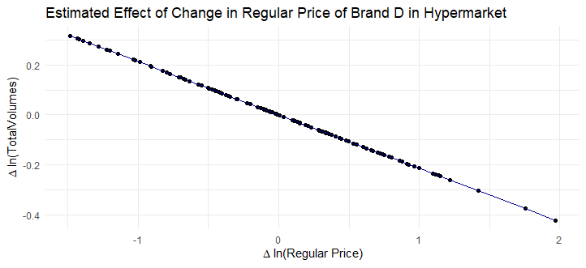<figcaption></figcaption></figure>
<figure>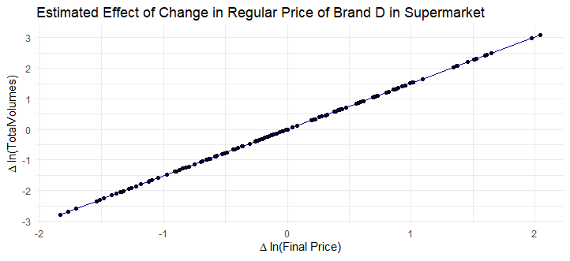<figcaption></figcaption></figure>
<figure>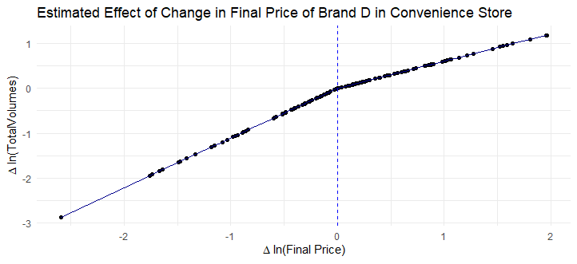<figcaption></figcaption></figure>

However, with enough data points, one can try to explore the extended version of model (detail is available in the appendix of [the slides](https://github.com/tanetpongc/discounthreshold/blob/1bb89dece2afd21c0049779557cf1bf1af96a64d/slide_deck/Slides_nonlinear.pdf)) adopted from [Pauwels et al., 2007](https://www.jstor.org/stable/40057075) including threshold indicating the point the elasticity change (for example, when price increase too much, we stop buying). Please bear in mind that the nonlinear estimation requires a lot of input regarding initial value of thresholds and change in gain and loss in elasticities.

I tried to impose extended model without. As our data is purely simulated without an attempt to reflects real world, the results do not look very realistic.

<details>
  <summary>Estimate nonlinear model with threshold </summary>

```R
Est_modelwiththreshold <- showcase_threshold_mod5(df[brand == "B" & format == "hypermarket",],alpha_g_regprice = 2,alpha_l_regprice = 1,threshold_l = -10,threshold_g = 0,gamma = 300)

# Plot
dt_Est_modelwiththreshold  <- data.table(x = seq(min(df[brand == "B" & format == "hypermarket",]$dlogavgregprice), max(df[brand == "B" & format == "hypermarket",]$dlogavgregprice), by = 0.01))

# Extracting values
regprice_elas <- as.numeric(Est_modelwiththreshold[par_LS_name == "regprice_elas", par_LS.est][1])
regprice_elas_gain <- as.numeric(Est_modelwiththreshold[par_LS_name == "regprice_elas_gain", par_LS.est][1])
regprice_elas_loss <- as.numeric(Est_modelwiththreshold[par_LS_name == "regprice_elas_loss", par_LS.est][1])
thresholdregprice_gain <- as.numeric(Est_modelwiththreshold[par_LS_name == "thresholdregprice_gain", par_LS.est][1])
thresholdregprice_loss <- as.numeric(Est_modelwiththreshold[par_LS_name == "thresholdregprice_loss", par_LS.est][1])

gamma = 300

fit_Est_modelwiththreshold <- (regprice_elas
                          + regprice_elas_gain * (1 + exp(gamma * (dt_Est_modelwiththreshold$x - thresholdregprice_gain)))^-1
                          + regprice_elas_loss * (1 + exp(-gamma * (dt_Est_modelwiththreshold$x - thresholdregprice_loss)))^-1) * dt_Est_modelwiththreshold$x

fit_transition_Est_modelwiththreshold <- (regprice_elas
                                     + regprice_elas_gain * (1 + exp(gamma * (dt_Est_modelwiththreshold$x - thresholdregprice_gain)))^-1
                                     + regprice_elas_loss * (1 + exp(-gamma * (dt_Est_modelwiththreshold$x - thresholdregprice_loss)))^-1)

dt_Est_modelwiththreshold[, `:=`(Nonlinearealasticity = fit_Est_modelwiththreshold,
                       Transitionfunction = fit_transition_Est_modelwiththreshold)]

ggplot(dt_Est_modelwiththreshold, aes(x = x, y = fit_Est_modelwiththreshold)) +
  geom_line(color = "darkblue") +  
  theme_minimal() +
  labs(title = "Nonlinear Price Elasticities for brand B in Hypermarket", 
       x = "Regular Price Gap", 
       y = "Sales Change")

ggplot(dt_Est_modelwiththreshold, aes(x = x, y = fit_transition_Est_modelwiththreshold)) +
  geom_line(color = "darkblue") +  
  theme_minimal() +
  labs(title = "Transition Function for the Three-Regime Quadratic Logistic Sales Model of brand B", 
       x = "Regular Price Gap", 
       y = "F(GAP)")
```
</details>

<figure>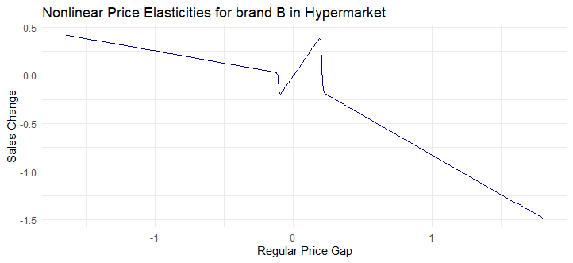<figcaption></figcaption></figure>
<figure>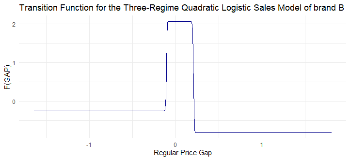<figcaption></figcaption></figure>

### Utility Choice Model Results for Brand D
<details>
  <summary>Estimate Utility Choice Model </summary>

```R
# LOAD DATA 
df_choice <- fread("../gen/df_choice.csv")
df_choice[, bought := as.logical(choice)]
df_choice <- as.data.frame(df_choice)  # Convert to dataframe to fit with mlogit

df <- mlogit.data(df_choice, choice = "bought", shape = "long", chid.var = "chid", id = "cust", alt.var = "brand_alt")

# ESTIMATE
#Random parameters are purely assumed for this simulated data
# Choice model where there is asymmetry of final price (gain VS loss) in convenience store
m_utilitychoice <- mlogit(bought ~ hyperregprice + hyperdiscount 
                          + convefinalpricegain + convefinalpriceloss + convefinalprice 
                          + superfinalprice + Nonfocal_intercept + loyal_nonfocal |-1, data = df, panel = TRUE, rpar = c(Nonfocal_intercept = "n",loyal_nonfocal = "n"), correlation = FALSE, R = 100, Halton = NA)
summary(m_utilitychoice)
```
</details>

|                        | **Dependent variable: Bought** |
| ---------------------- | ----------------------- |
| RegPrice - Hypermarket  | 0.003 (0.004)           |
| Discount - Hypermarket| -0.004 (0.006)          |
| Final Price Gain - Convenience | -0.018*** (0.005)       |
| Final Price Loss - Convenience    | -0.008* (0.005)         |
| Final Price - Convenience   | 0.003 (0.004)           |
| Final Price - Supermarket      | 0.005 (0.004)           |
| Nonfocal_intercept     | 0.969*** (0.058)        |
| Loyal_nonfocal        | 0.382*** (0.058)        |
| sd.Nonfocal_intercept  | 0.008 (0.416)           |
| sd.loyal_nonfocal      | 0.027 (0.460)           |
| ---------------------- | ----------------------- |
| Observations           | 3,241                   |
| Log Likelihood         | -1,697.858              |
| ---------------------- | ----------------------- |
| **Note:**              | *p<0.1; **p<0.05; ***p<0.01 |

* Based on our simulated data, customers generally prefer nonfocal brand and they tend to be responsive for final price change in convenience store
